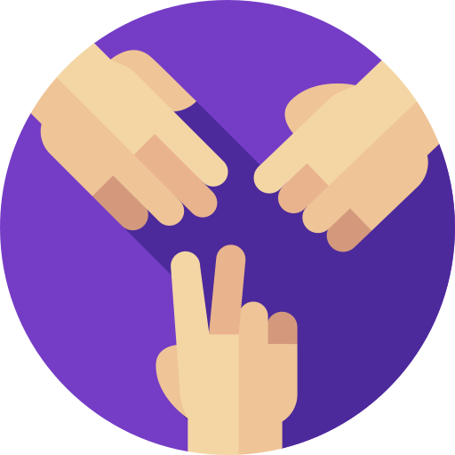

<p align="center">
    
</p>
<p align="center"><h1 align="center">Rock Paper Scissors Game 🎮🪨📄✂️</h1></p>
<p align="center">
	<em>Welcome to the ultimate showdown of wits and reflexes! Get ready to challenge your friends, family, and even your pet goldfish (who’s definitely judging your choices) in the classic game of Rock Paper Scissors! This project is built with love using React, and it's here to bring a smile to your face and a thrill to your fingertips! 😄</em>
</p>
<p align="center">
	
	
	
	
</p>
<p align="center">Built with the tools and technologies:</p>
<p align="center">
	
	
	
	
	
</p>
<br>

## 🔗 Table of Contents

- [📁 Project Structure](#-project-structure)
- [🚀 Getting Started](#-getting-started)
  - [☑️ Prerequisites](#-prerequisites)
  - [⚙️ Installation](#-installation)
  - [🤖 Usage](#🤖-usage)
  - [🧪 Testing](#🧪-testing)
- [How to Play 🥳](#how-to-play-)
- [Contributing 🤝](#contributing-)
- [🎗 License](#-license)

---


## 📁 Project Structure

```sh
└── rock-paper-scissors/
    ├── README.md
    ├── package-lock.json
    ├── package.json
    ├── public
    │   ├── index.html
    │   ├── manifest.json
    │   ├── robots.txt
    │   └── rock-paper-scissors.png
    └── src
        ├── App.css
        ├── App.js
        ├── components
        ├── index.js
        └── setupTests.js
```


---
## 🚀 Getting Started

### ☑️ Prerequisites

Before getting started with rock-paper-scissors, ensure your runtime environment meets the following requirements:

- **Programming Language:** JavaScript
- **Package Manager:** Npm


### ⚙️ Installation

Install rock-paper-scissors using one of the following methods:

**Build from source:**

1. Clone the rock-paper-scissors repository:
```sh
❯ git clone https://github.com/scary-sherlock/rock-paper-scissors
```

2. Navigate to the project directory:
```sh
❯ cd rock-paper-scissors
```

3. Install the project dependencies:


**Using `npm`** &nbsp; [](https://www.npmjs.com/)

```sh
❯ npm install
```


### 🤖 Usage
Run rock-paper-scissors using the following command:
**Using `npm`** &nbsp; [](https://www.npmjs.com/)

```sh
❯ npm start
```


### 🧪 Testing
Run the test suite using the following command:
**Using `npm`** &nbsp; [](https://www.npmjs.com/)

```sh
❯ npm test
```


---
## How to Play 🥳

1. <b>Choose Your Weapon:</b> Select Rock, Paper, or Scissors. Choose wisely; your fate is in your hands! 🥴 (Remember, Rock beats Scissors, Scissors beats Paper, and Paper beats… well, your hopes and dreams if you lose!)

2. <b>Face Off Against the Opponent:</b> The computer will randomly choose its weapon. Will it be Rock, Paper, or Scissors? (Spoiler: It’s always Scissors! Just kidding! 😜)

3. <b>See the Results:</b> Will you emerge victorious? Or will you face the dreaded defeat? Either way, you’ll get a score update! 🏆 (And maybe a reminder that you should’ve chosen Paper instead of Rock… just like that time you chose the wrong Netflix show to binge-watch!)

4. <b>Play Again:</b> Feeling lucky? Hit the "Play Again" button and challenge your fate once more! Or just keep losing and blaming it on Mercury being in retrograde. We’ve all been there! 😂

---

## Contributing 🤝

- **💬 [Join the Discussions](https://github.com/scary-sherlock/rock-paper-scissors/discussions)**: Share your insights, provide feedback, or ask questions.
- **🐛 [Report Issues](https://github.com/scary-sherlock/rock-paper-scissors/issues)**: Submit bugs found or log feature requests for the `rock-paper-scissors` project.
- **💡 [Submit Pull Requests](https://github.com/scary-sherlock/rock-paper-scissors/blob/main/CONTRIBUTING.md)**: Review open PRs, and submit your own PRs.

<details closed>
<summary>Contributing Guidelines</summary>

1. **Fork the Repository**: Start by forking the project repository to your github account.
2. **Clone Locally**: Clone the forked repository to your local machine using a git client.
   ```sh
   git clone https://github.com/scary-sherlock/rock-paper-scissors
   ```
3. **Create a New Branch**: Always work on a new branch, giving it a descriptive name.
   ```sh
   git checkout -b new-feature-x
   ```
4. **Make Your Changes**: Develop and test your changes locally.
5. **Commit Your Changes**: Commit with a clear message describing your updates.
   ```sh
   git commit -m 'Implemented new feature x.'
   ```
6. **Push to github**: Push the changes to your forked repository.
   ```sh
   git push origin new-feature-x
   ```
7. **Submit a Pull Request**: Create a PR against the original project repository. Clearly describe the changes and their motivations.
8. **Review**: Once your PR is reviewed and approved, it will be merged into the main branch. Congratulations on your contribution!
</details>

<details closed>
<summary>Contributor Graph</summary>
<br>
<p align="left">
   <a href="https://github.com{/scary-sherlock/rock-paper-scissors/}graphs/contributors">
      
   </a>
</p>
</details>

---

## 🎗 License

This project is licensed under the MIT License. Feel free to use it, modify it, and share it with your friends. Just don’t forget to give credit where credit is due! 🙌 (And if you win, remember to thank your computer for its “excellent” choices—because we all know it’s secretly plotting against you!)

---

So, what are you waiting for? Get your game face on, gather your friends, and may the best player win! 💪🏽🥇 Happy gaming! 🎉 (And remember, if you lose, it’s just a game… but we all know you’ll be plotting your revenge like a true mastermind! Just like the villains in your favorite superhero movies

---
